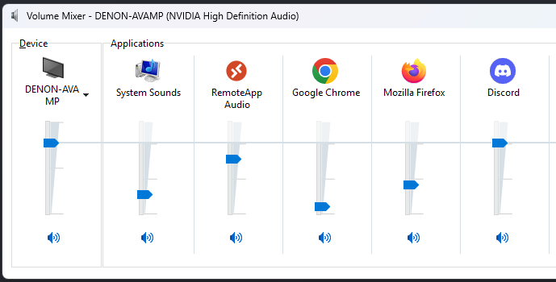
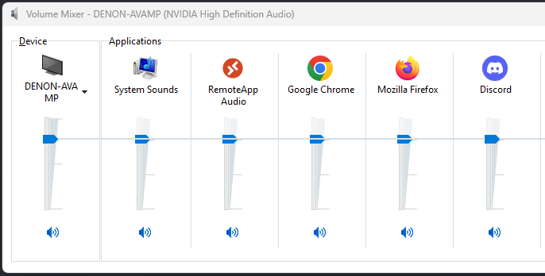

**NOTE:** This code is provided as-is. It's just whatever I was working on at the time.

# Summary

This is my attempt to make an easier way to set the Windows volume for all apps to match the master volume level.

# Reasoning

When some apps, like Discord, frequently attenuate the volume of other apps, the volume level of other apps doesn't always return to the original value. A common example is to trigger attenuation while using a push to talk (PTT) button, or when other people talk. After a while, some apps may have their volume level severely reduced below the master volume level. With a Python script, all apps can be brought back to match the master volume level. This can be set as a shortcut as an easy way to fix the volume levels quickly.

# Setup

Install the `pycaw` dependency in some way.

https://github.com/AndreMiras/pycaw

Global:
```bash
pip install pycaw
```

# Usage

### Start with this problem:



### Run this script:

```bash
python volume_to_master.py
```

### Result:

All application volume levels should now match the master volume level in volume mixer.


